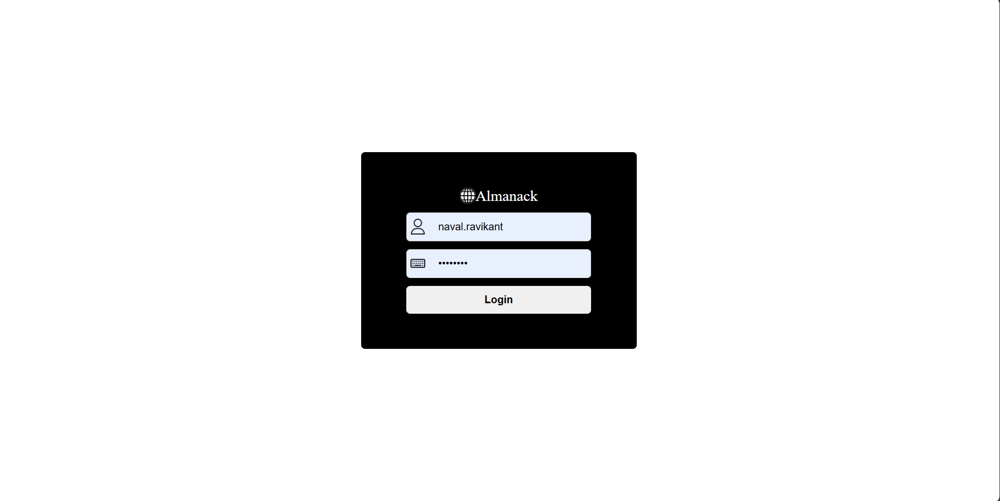
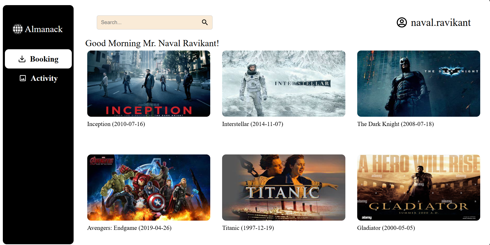
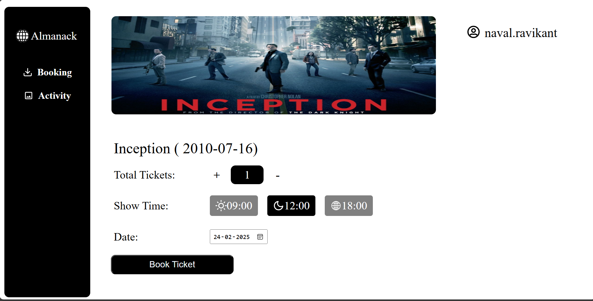

# Movie Ticket Booking Web-App

This is a React.js based **Movie Ticket Booking Portal**. The application allows users to authenticate, browse and book movie tickets, view their booking history, and manage state efficiently.

## 🚀 Live Demo

**Deployed Link:** [https://movieapplication-rosy.vercel.app/](#)

username : naval.ravikant

Password: 05111974

---

## 📜 Features

### 🔑 1. Login

- Users authenticate using **hardcoded credentials**:
  - **Username:** `naval.ravikant`
  - **Password:** `05111974`
- Displays error message "Wrong Credentials" on incorrect login.
- Successful login routes the user to the **Booking Screen**.

### 🎥 2. Booking Screen

- Displays a **list of movies** with **name, year, ID, and image**.
- Implements a **real-time search filter** based on movie names.
- Clicking on a movie card redirects to the **Selection Screen**, passing the selected movie data.

### 🎟️ 3. Selection Screen

- Users can enter **ticket count, time, and date** (defaults: 1 ticket, 12:00 PM, current date).
- Clicking **'Book Ticket'**:
  - Creates a **new ticket entry**.
  - Shows a **loading animation** & **toast notification** (`Tickets Booked`).
  - Redirects to the **Activity Screen** after 5 seconds.

### 📜 4. Activity Screen

- Displays a **list of booked tickets** with:
  - **Movie Name**
  - **Ticket Count**
  - **Time & Date**
  - **Total Amount** (\$25 \* Ticket Count)

### 🔄 State Management

- **Global State Management** using `Context API`.
- **Persistent Data** stored in **localStorage** to prevent loss on refresh/navigation.
- **Smooth Navigation** using `react-router-dom`.

---

## 🛠️ Tech Stack

- **Frontend:** React.js / Next.js
- **State Management:** Context API + LocalStorage
- **Routing:** React Router
- **UI Components:** Figma-based design, CSS Modules
- **Animations & Notifications:** React-Toastify, React-Loader-Spinner
- **Deployment:** Vercel

---

## 📜 Installation & Setup

1️⃣ Clone the repository:

```bash
git clone https://github.com/Suryanra/movieapplication.git
cd movieapplication
```

2️⃣ Install dependencies:

```bash
npm install  # or yarn install
```

3️⃣ Start the development server:

```bash
npm start  # or yarn start
```

4️⃣ Open in browser:

```
http://localhost:3000
```

---

## 🚀 Deployment

The project is deployed on **Vercel**:


---

## 📸 Screenshots








---
